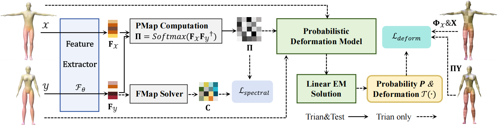
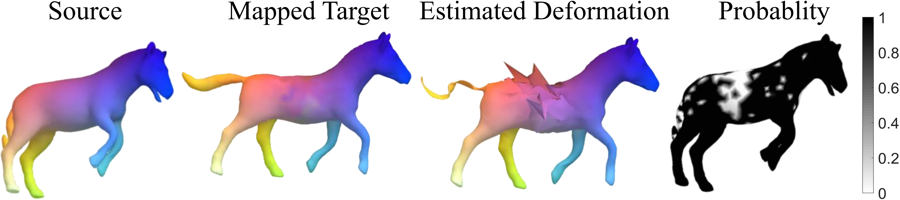
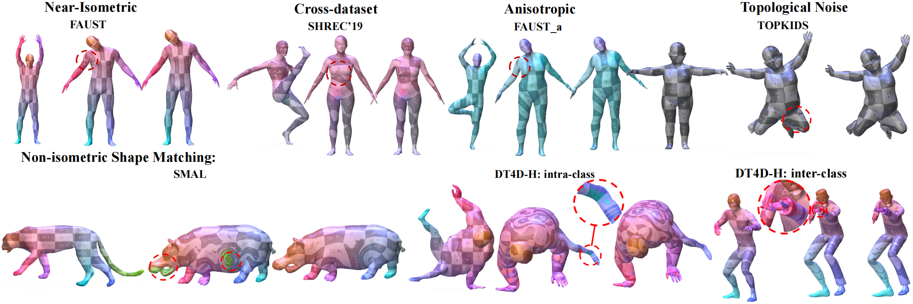

# PDCMatch
Probabilistic Deformation Consistency for Unsupervised Shape Matching, AAAI-2026

## Overview
<p align="center">
  
</p>

## Probabilistic Deformation
<p align="center">
  
</p>

## Qualitative Results
<p align="center">
  
</p>
Qualitative comparisons demonstrate the effectiveness of our method under challenging scenarios.

If you find this project useful, please cite:

```
@inproceedings{xia2025probabilistic,
  title={Probabilistic Deformation Consistency for Unsupervised Shape Matching},
  author={Xia, Yifan, Ye, Tianwei, Jun Huang, Xiaoguang Mei, Jiayi Ma},
  booktitle={Proceedings of the AAAI Conference on Artificial Intelligence},
  year={2026}
}
```
